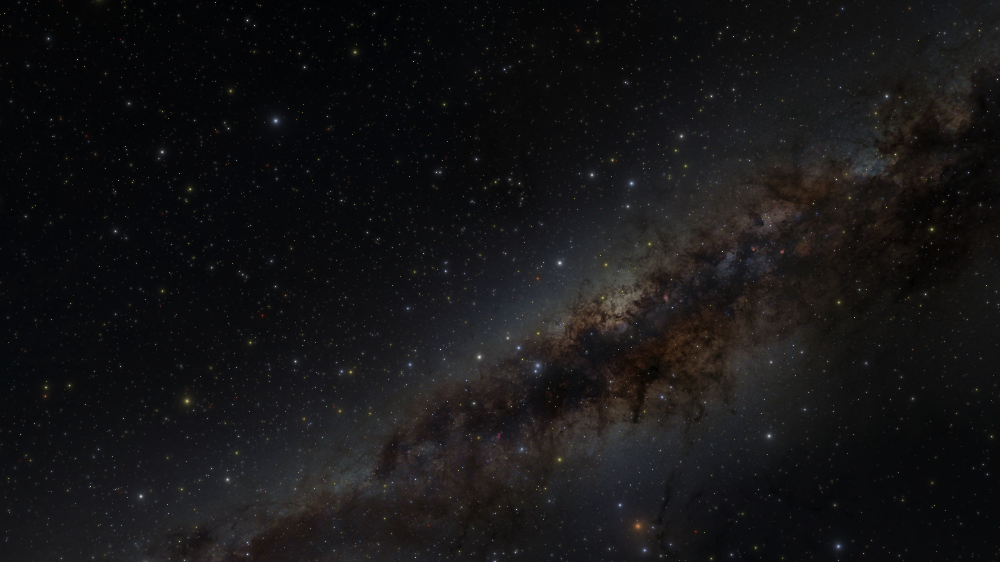
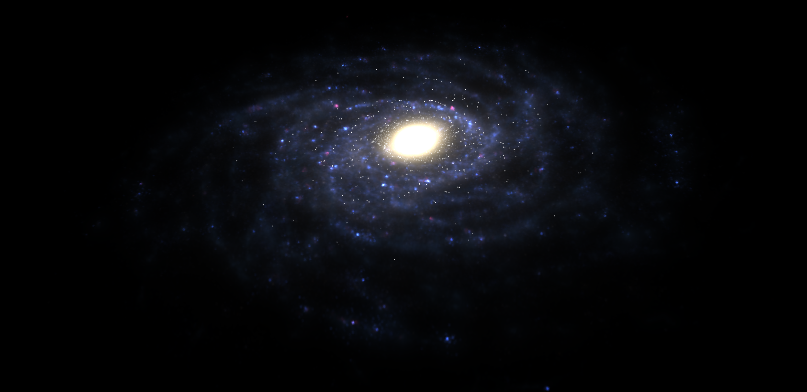
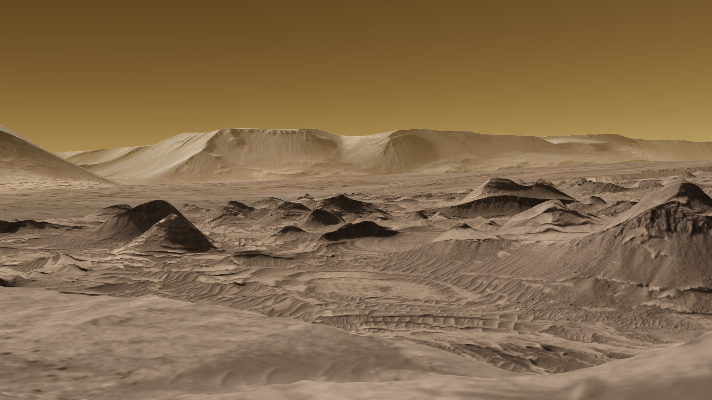
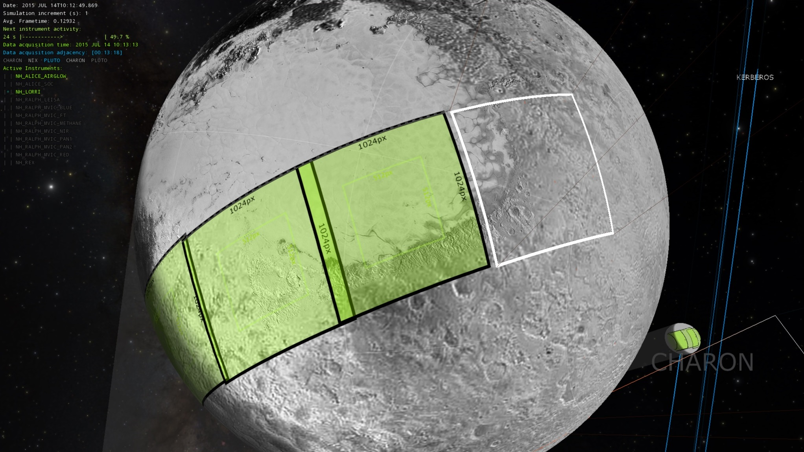
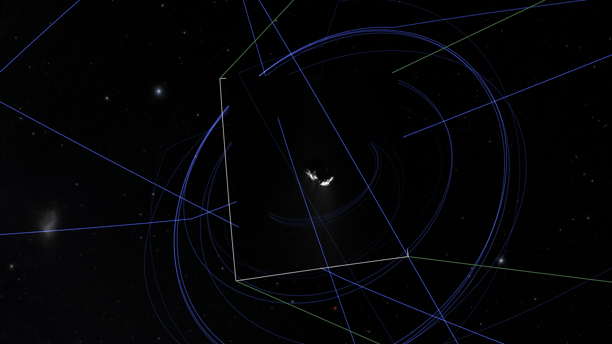
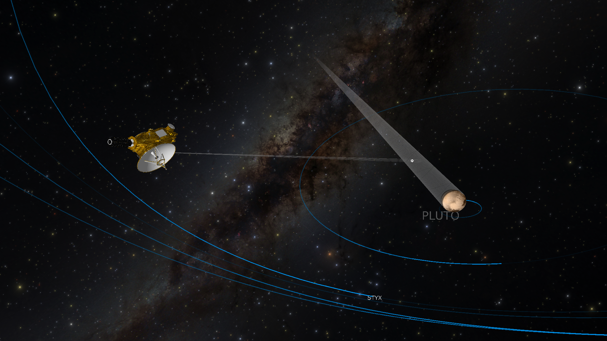
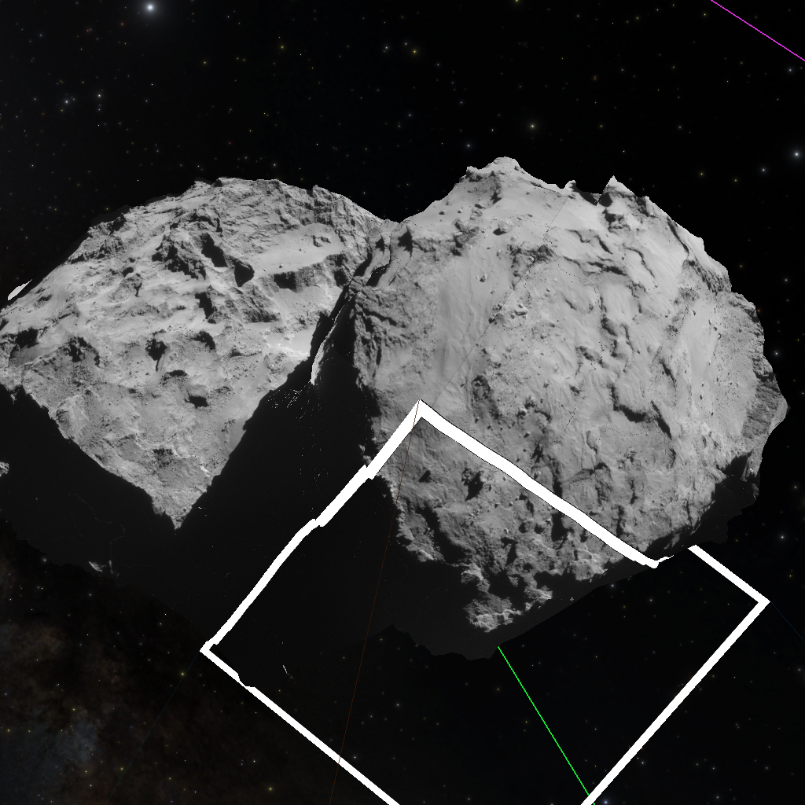
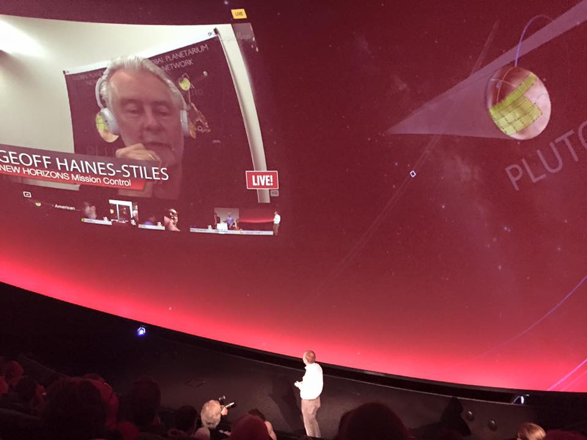

Title: OpenSpace -- Changing the narrative of public disseminations from **what** to **how**

Authors: Alexander Bock, Emil Axelsson, Carter Emmart, Masha Kuznetsova, Anders Ynnerman

# Introduction

Since the dawn of time, humans have looked up to the night sky in an attempt to understand the surrounding world.  The movements of the Moon and stars and planets have shaped civilizations by producing calendars and aiding in navigation, while the shape of patterns in the night sky inspired tales all around the world.  Undoubtedly, the history of mankind has been shaped by our Moon, the five planets, and the 10000 or so stars that are visible to the naked eye.  Telescopes and satellites enable us to see that this, however, is only a tiny slice of the eight planets, hundreds of moons, billions of galaxies, and countless stars and exoplanets in the entire observable universe.

Understanding the process of scientific discoveries and their results are key to understanding our cosmic origins, potential dangers, and our long-term future.  While small telescopes are readily available and allow amateur astronomers a deeper view into the cosmos, only a small enthusiastic group deal with the calibration, assembly, and usage of home telescopes.  The rest of humanity has to rely on professional telescopes to produce stunning pictures of the night's sky that are the result of very long exposures that cannot be reproduced by the human eye.  Unfortunately, the context in which these images are taken is lost in many cases, even when it comes to simple tasks as locating the photographed area in the sky.  For many years, planetariums have provided this context to the public by reproducing the night sky to support explanations and tell compelling stories.  These explanations are often provided by an expert in the field and grant easy access to the knowledge about the cosmos and all its wonders.

With modern technology and the digitalization that all planetariums underwent during the last decade [1], it is now possible to enhance the presentation methods by utilizing immersive 3D computer graphics [2].  This allows planetarium visitors to not only look up at the night's sky, but virtually leave Earth and watch any content, which, in turn, enables the public dissemination of a much broader array of discoveries.  However, these important developments have not solved the issue of scalability as the guided experiences are only useful for the hundred or so visitors that can be seated in a planetarium, but they cannot reach a broader audience due to the physical limitations of a planetarium.  One partial solution is the ability to connect multiple planetariums for a shared one-to-many experience.  In these cases, a single expert's voice and video feed is transmitted to other connected planetariums in order to reach a broader audience.  These solution, however, limit the distribution of lectures and explanations to bigger planetariums due to high costs that inhibit smaller venues to purchase the same specialized software to participate in these events.

By providing an astronomical software for free as open-source that can perform these dissemination tasks, it is possible to reach a much wider audience.  In addition, by designing the software capable of producing high fidelity renderings on both planetarium surfaces as well as regular desktop or laptop monitors, the outreach can be exponentially bigger as a much larger audience can experience and participate in these disseminations from their home computers.  While this removes the immersive experience of the explanations, it opens up the public access by an order of magnitude or more.  Furthermore, the ongoing proliferation of headmounted displays, such as the Oculus Rift or the HTC Vive, make it possible to experience a similar immersive experience on the home computer as is felt in a planetarium setting.  With the prices of these devices falling in the upcoming years, many more people will be able to afford and utilize such devices.

A second ongoing evolutionary step that we are proposing is the gradual transition in explanations from **what** has been discovered by telescopes and measurements over to **how** it is being discovered.  The idea behind this is to not only show scientific results, but also explain the planning stages and the intricate process of the data acquisition itself. By including the general public in the process of scientific discovery, it allows them to understand the underlying complexity and gain a deeper appreciation for the collected data.  This will ultimately result in a better educated populous that is more willing to spend the effort and resources to widen our collective scientific horizon.

The rest of this article is organized as follows: First, we will describe the basic conceptual ideas behind the open-source software *OpenSpace*, which provides the capabilities for these public disseminations before focussing on individual aspects of the software exemplified on four applications;  1. the *New Horizons* space craft performed a fly-by event at Pluto in July 2015, collecting much information about this previously unvisited dwarf planet;  2. the *Rosetta* spacecraft entered the orbit of the comet 67P/Churyumov-Gerasimenko in August 2014, performed measurements during its approach to the Sun, and ended its mission in September 2016 by landing on the comet;  3. the study of the solar system conditions collectively known as *Space weather*, which refers to the conditions of the plasma being ejected from the Sun both as a continuous stream, the solar wind, as well as abrupt eruptions, such as coronal mass ejections;  4. a system for interactive display of high resolution level-of-detail planetary images, exemplified in the rendering of Earth and Mars.  All these events had different parameters and objectives and highlight a variety of challenges, whose solutions are applicable to similar events.

# Software
In order to facilitate the mass dissemination of astrophysical and astronomical data, we developed an extensible open-source software called *OpenSpace* that can be used as a platform to display a large variety of data sources.  The system is not limited to any specific scientific domain, but has been developed to support a large number of contextualized visualizations, such as geometric models, volumetric data, data-derived geometry, or abstract visualizations.  By providing a rich, modular framework for developers, it is possible to integrate new visualizations and build an ecosystem of modules that can be used by anyone.

We believe that the benefits of interactive presentations outweigh the higher production value of prerendered content. This is especially true for concurrent activities that benefit from a quick turnaround time for explanations.  Other applications have previously provided such a service, such as Uniview, Digital Sky, Digistar, Eyes on the Solar System, and others.  Many of these systems are commercial products and, thus, generally limiting their potential reach.  In addition to requiring specialized hardware or licenses, putting a severe limitation on smaller venues that cannot generate enough revenue to allow for such an expense, the closed-source approach of these products also limits the variety of data that can be displayed.  In these systems, content creators are limited to the rendering capabilities that are included and exposed in those softwares and are, usually, unable to write and integrate their own rendering modules that produce novel visualization techniques.  This tradeoff limits the integration of new features, especially for venues that cannot afford to commission a custom rendering module written by the vendor directly.

Through the use of open-source software we have taken a different approach to this tradeoff, thus reducing the necessary investment to develop and include new rendering techniques by exposing the entire software for customization.  One important historical software that have done this previously is Celestia, whose open-source development effectively stopped in 2010.  With *OpenSpace* we are building on the success of open-source software to provide a content-rich, community-curated environment for the general public as well as planetariums.  Having a central instance that combines the efforts of small-to-medium venues and private citizens makes it possible to combine the benefits of a wide user base with the necessary expert knowledge for data integration.  In the following section, we will elaborate on the building blocks that are used to generate these modules.

## Dynamic Scene Graph
Integrating many large-scale astronomical data sets into a common reference frame can be taxing as the floating point representation of numbers in computers does not have infinite precision [3].  This restricts the relative scales of objects which can be represented in a single scene.  The most widely used floating point number formats in computing are defined in the IEEE 754 standard as single and double precision with 32 bit and 64 bit respectively.  Combining the floating decimal point and the finite storage means that the precision to represent numbers decreases with increasing magnitudes.  This does not become an issue as long as objects of similar magnitude are displayed.  However, if objects of vastly different magnitudes are involved, an accurate representation is no longer possible.  As an example, the minimal value that can be added to a single precision floating point value v is $\approx ~10^8 \cdot v$.  Every number smaller than this will be rounded to the same number.  Without any special consideration, this inhibits the use of a single coordinate system for objects even in our solar system.  If the Sun is the origin of the coordinate system, the 32 bit floating point precision error at Pluto results in the whole planet only containing 8 distinct distance values, with all intermediate values clamped to these distinct values.

One possible solution to this issue is the concept of a ScaleGraph [4] which is a modified scene graph that contains different scales as intermediate nodes.  Each scale describes distances to child nodes and objects in their canonical scaling.  This graph structure then enables translation and scaling each visible object in the scene to be represented at the correct relative size without a loss of precision.  However, due to a necessary reprojection, issues regarding to stereoscopic rendering and scale transitions are introducted.

In *OpenSpace* we instead employ a Dynamic Scene Graph which is similar to the ScaleGraph, but does not utilize native scales and does not explicitly reproject objects to the current scale [5].  Instead, all objects in the scene are rendered relative to the camera at their correct distances with the closest object to the camera always serving was the global coordinate system origin.  This makes use of the fact for far away objects to be visible, they have to be sufficiently large, thus not making it necessary to render small variations on their surface.

## SPICE
In order to render astronomical objects in their correct positions, potentially complex trajectories have to be computed.  In the easiest case of undisturbed orbits, the only information necessary are the six Keplerian elements from which the location of a body relative to a target reference frame can be retrieved.  However, this simple representation does not capture any complex orbital mechanics such as the influence of additional bodies or effects from general relativity such as seen in, for example, the precession of Mercury.  Therefore, a more sophisticated method for determining complex orbits has to be employed.

One widely used library called *SPICE* is provided by NASA and provides mission planning quality access to location and attitude of spacecraft, planets, and other objects through the use of *kernels*.  One type of SPICE kernels provides location information for a specific time period.  While these can be provided analytically, in most cases a higher order approximation or explicit sampling strategy is used for spacecraft with complex trajectories.  Using the SPICE library provides instant access to all of this information and the capability to query locations in a variety of coordinate systems, enabling the use of the optimal coordinate system for each object.  Furthermore, it provides information about instruments onboard spacecrafts, such as the viewing angle, the shape of the field-of-view, or conversions regarding the on-board mission clock.

SPICE kernels are heavily used by spacecraft operators in the planning phase of various missions, which has the additional benefit of making these kernels readily available for a large number of missions and also guarantee the accuracy of these kernels.  While the scientific accuracy during the visualization has to be sufficiently high, the spacecraft planning and development phases necessitate an even higher level of accuracy.

## Digital Universe
> Reference A Flight through the Universe [X]

Figure 1. An accurate and visually pleasing representation of the night's sky provides adequate context to mission visualization.

Measurements of stars and galaxies have been performed by different research groups over the cause of many years, leading to many inconsistencies in the provided data formats and coverages.  One successful effort to curate all available datasets is the *Digital Universe*, curated by the American Museum of Natural History.  It collates information such as position, color, images, and spectral measurements of many visible stars in the Milky Way, as well as data about galaxies, quasars, and other celestial objects.  By incorporating this extensive database, it is possible to render a visually appealing and accurate representation of the night's sky (see Figure 1) to provide necessary context to activities in the solar system, let alone the possibility to integrate visualizations of events outside of the solar system and provide a three dimensional view on the stars closest to the Sun.

Stars are rendered as camera-aligned billboards where the billboard is resized according to the distance to the camera as well as the absolute brightness of the star; the closer and brighter a star is, the bigger the billboard.  This represents an artistic choice.  In the idealized rendering, each star, regardless of distance and brightness would have the same size, which would be very close to a perfect point light source (Sirius, the brightest star, has an angular extent of $8.5 \cdot 10^{-7}$ degrees from Earth).  However, our eyes and telescopes apply a point spread function that extends this point into an image.  The result depends on the apparent magnitude of the star, which, in turn, depends on the distance to the camera and the absolute brightness of the star.  We simulate the point spread function of an idealized telescope on the billboard by applying a Gaussian falloff.  This results in a realistic and appealing visual representation.  By interactively computing the apparent magnitude, we also account for the changing location of the camera when moving outside of the solar system.  This produces a rendering of stars as a telescope at the position of the virtual camera would perceive them.  In addition, by exchanging the texture which is used for the point spread function, it is possible to simulate the visual appearance from different telescopes.

For all galaxies except the Milky Way, a similar billboard technique can be applied.  However, instead of aligning the billboard to the camera, it has to be aligned to the location of the Sun in order to provide the ability to fly close to a distant galaxy and retain the view as seen from Earth.  Instead of using a Gaussian point spread function, the image as captured by various telescopes is used while the billboard is resized to reflect their accurate projected size.  These images can either be reconstructed from optical light or any other detection method. 

Figure 2. A volumetric rendering of the Milky Way using a statistical distribution of stars and gas.

While being inside our solar system, the Milky Way cannot be projected as a billboard as it surrounds the camera in every direction.  Hence we make use of a textured sphere that has an omnidirectional texture of the Milky Way mapped to its inside surface as an environment map.  For the texture we use a modified version of an all-sky survey by Mellinger [6] to which a post-processing has been applied to remove all of visible stars.  While this representation looks correct if the camera is inside our solar system, the sphere has to be replaced by a simulated, volumetric representation of the Milky Way when the camera is outside the local area of the solar system.  This volumetric data is generated from statistical models of matter distribution in our galazy, which has been used to simulate the presence of various kinds of dust, the location of stars and much more (see Figure 2).

## Planetary Rendering
Planetary surfaces are an important aspect for the visual fidelity of the system.  For many planets in the solar system, such as Earth, Mercury, or Mars, humanity has acquired images of such high detail that simple texturing is unfeasible and a hierarchical level-of-detail approach is necessary which takes the distance of the camera to the planet, as well as the planet's visual footprint into account.  The same aspect applies to detailed terrain models, such as heightmaps, which are subsequently used to position other objects on the surface of a planet.

Figure 3. Showing the mountains of the Himalayas using the ESRI World Imagery dataset with the Moon in the background.

Figure 4. Showing the surface of Mars as reconstructed from the Mars Reconnaissance Orbiter's Context camera.

An important aspect in visualizing scientific discoveries is providing an adequate context.  Similar to using the stars and the Milky Way as a background for mission and space weather visualization, it is necessary to provide a rich context for the Earth sciences.  To this end, we make use of a widely used set of standards for the delivery of planetary images called *Web Map Service* [7].  These standards enable a level-of-detail technique to request image tiles on a planet and allow an application to resolve very high resolution details.  By treating local height information as a greyscale image, it furthermore becomes possible to produce 2.5D terrain renderings with the same methods (see Figure 3).  One use case for this application is the fleet of Earth-orbiting spacecraft gathering a variety of measurements, for example the ozone layer, pollutants, or temperatures.  Another use case is a high fidelity rendering of other planetary surfaces.  For Mars, there exist a large database of surface images retrieved from the Mars Reconnaissance Orbiter that can be used to create realistic surface renderings of planets that most people will likely never see in person (see Figure 4) [8].

Supporting a wide variety of standards for image loading is an important aspect for specialization as many venues have access to high-resolution arial photography of their surroundings and want to integrate this to provide a higher fidelity experience for visitors.  Creating a database of these higher terrain resolutions is a potential citizen scientist project enabled by our system.

## Image Projection
Distributed in the solar system, the human fleet of space craft has a large variety of available instruments, such as radiometer, dust counters, or magnetometers, to gather information.  However, one of the instruments that is most intuitive for the general public are image-generating cameras.  From the cameras onboard Luna 3 taking grainy pictures of the far side of the moon in 1960, up to the modern high-resolution cameras onboard the New Horizons space craft, images have always inspired the public and are hugely successful in generating public interest and understanding.

Figure 5. Showing the footprint of the LORRI camera on Pluto' surface after taking three pictures. [TODO: Redo without info text]

Figure 6. Projecting onto an additional image plane enables the visualization of outgassing, in this case on the comet 67P/Churyumov–Gerasimenko. [TODO: Redo without info text]

Our main goal is not to only present the final images, but show the context of their acquisition and the spatial relationship to the target body and other images.  In order to achieve this, we make use of an image projection method presented by Everitt et al. [9] to project the images onto the target body.  Using information about the camera's field-of-view, acquisition time, and pointing direction, it is possible to treat the camera as a virtual projector that casts the image onto the target body (see Figure 5).  This method resolves projection artifacts and is easily generalized to include multiple images or non-square image geometries.  Furthermore, by including an additional virtual image plane to project upon, it is possible to handle images in which the target object is not filling the entire frame or the subject of interest is not a physical body (see Figure 6).

While this method is easily applicable for spherical bodies as there is no self-shadowing on those bodies, it becomes more difficult on complex, concave geometries.  The standard image projection algorithm does not include any occlusion checks, which can lead to undesirable visual results.  One possible solution for this uses a shadow map algorithm that identifies the target object's first projection point for given camera frustum.  Only the points that are not in shadow from the camera are used for the projection.  With this method it is possible to project images not only onto regular bodies such as planets and moons, but also irregular bodies such as the comet 67P/Churyumov–Gerasimenko (see Figure 6).

### New Horizons

Figure 7. New Horizons' view of Pluto and its moons. The active LORRI camera's frustum is shown extending from the space craft.

NASA's mission flew by the Pluto system on July 14th, 2015 and took measurements with its seven instruments.  Of special interest are the LORRI and RALPH instruments, providing images of Pluto, Charon, and its moons' surfaces, as well as REX, measuring Pluto's atmosphere (see Figure 8).  The measurement times for all instruments are presented to the user, but not all instruments have a direct visual mapping. This mission was disseminated to about 2000 people during a public, global event in which 13 different locations participated.  During a 2h live show, which coincided with New Horizons closest approach to Pluto, experts on the mission team explained details of the desired outcome using *OpenSpace* as the source of the contextualization for these informations.  In addition to the live audience in the participating locations, a video stream of the event was available on the Internet, which was also later provided as a video-on-demand, called "Breakfast at Pluto".

### Rosetta

Figure 8. Projecting images on the concave comet 67P/Chryumov-Gerasimenko.

ESA's Rosetta mission orbited the comet 67P/Churyumov-Gerasimenko between August 2014 and September 2016 at various altitudes while providing measurements about comet's activity, its mass, and amount of outgassing.  Among the utilized instruments are the fairly low resolution NAVCAM, which is primarily used for navigational purposes, but its images were released to the public much earlier than from other instruments.  The OSIRIS camera is a high-resolution $2048 \cross 2048$ pixel optical camera with a narrow angle and wide angle lens.  Images from both instruments can be used with previously described image projection (see Figure 9).  An interesting aspect of this mission is the complexity of the space craft's trajectory around the comet and thus the ability to explain complicated aspects of orbital mechanics using Rosetta as an example.  These range from the ability to measure the weight of the comet based on the deflection of the orbit, the avoidance of outgassing at the comet's aphelion, or the release of the Philae lander.

### Osiris Rex
Osiris Rex is a NASA mission that will orbit the asteroid Bennu and perform a sample return mission.  It launched in September 2016 and will end with a landing back at Earth in 2023.  During its stay at the asteroid, Osiris Rex will take detailed images of the entire surface of the asteroid.  This information is then used to select a sample site from which the asteroid samples will be collected.  In an event at the American Museum of Natural History, one of mission scientists explained the entire plan of the mission from launch to touch down to the public audience.  This mission is especially interesting as the space craft has to change its geometry to be able to collect samples from the asteriod without touching it or contaminating the acquired samples.

## Space Weather
Space Weather research is concerned with plasma conditions in the solar system ultimately caused by activity on the Sun.  These conditions have a great impact on both satellites as well as life on Earth thus making predictions very important.  Combining this with the complexity of the topic warrants the use of visualization techniques to bridge the gap between expert knowledge and public understanding.  Therefore, we integrated the scientists' Integrated Space Weather Analysis toolkit, developed at the Community Coordinated Modeling Center at NASA Goddard into *OpenSpace* such that the results can be directly disseminated to the public using the same expert analysis tools.  This also ties directly into NASA's Living with a Star program, whose mission is to improve the understanding of the Sun and how it affects the entire solar system.  One part of this work that deals with improving the forecasting capabilities by producing comparisons between simulations and in situ measurements was presented previously [10].

# Dome Casting

Figure 9. Utilizing the dome casting feature enables multiple experts to collaboratively explain difficult topics to a public audience.

One important feature of *OpenSpace* enabling the mass public dissemination of scientific topics is the concept of **Domecasting**.  Using a set of features that allow multiple instances of *OpenSpace* to be cross-linked and to replicate renderings on a multitude of distributed systems, it becomes possible to share explanations across the globe (see Figure 9).  Each instance of *OpenSpace* is running independently, but rendering settings are synchronized over a network connection.  These rendering settings are information about the virtual camera, the simulation time, changes to the simulation time, as well as other information influencing some aspect of the rendering, such as textures, adjustable transparencies, or enabling and disabling objects.  Any sufficiently small delay in his communication is acceptable as only information about changes is transmitted.  For a truly collaborative experience with presenters that are physically separated, it is also desirable to pass control between different application instances, thus enabling common decision making or information dissemination to a public.  Each *OpenSpace* instance runs independently, instead of receiving a prerendered image, in order to support the local rendering geometry.  For example, some clients might run a multi-pipeline planetarium setup while others run a single machine flat screen.  By abstracting this away from any remote operations, the system becomes more stable and agnostic to rendering changes.  In order to support venues that do not have the computational resources to perform a rendering locally, the software has the capabilities to stream a 360 degree rendering, which can be locally reprojected instead.

# Conclusion
In this paper, we presented an open-source framework called *OpenSpace* that supports the public dissemination of **how** scientific discoveries are made rather than purely focussing on **what** has been discovered.  This capabilities have been demonstrated in four different use cases, showing the usability of such an approach when performing public presentations.  By making the software freely available, it is possible to reach a much broader audience than previous solutions that limited explanations to larger planetarium venues.  This also creates opportunities for citizen science projects that curate the vast amount of information that we have gathered about the universe that surrounds us and thus ultimately educate humanity.

[1] Carolyn Sumners and Patricia Reiff. "Creating Full-Dome Experiences in the New Digital Planetarium." In NASA Office of Space Science Education and Public Outreach Conference, vol. 319, p. 155. 2004.
[2] Miguel A. Aragon-Calvo, and Mark SubbaRao. "A Flight through the Universe." Computing in Science & Engineering 17, no. 6 (2015).
[3] David Goldberg. "What every computer scientist should know about floating-point arithmetic." ACM Computing Surveys 23, no. 1 (1991).
[4] Staffan Klashed, Per Hemingsson, Carter Emmart, Matthew Cooper, and Anders Ynnerman. "Uniview-Visualizing the Universe." Eurographics 2010-Areas Papers (2010).
[5] Emil Axelsson, Jonathas Campi Costa, Claudio Silva, Carter Emmart, Alexander Bock, and Anders Ynnerman, "Enabling Scaling, Positioning, and Navigation in the Universe". EuroVis (2017)
[6] Axel Mellinger. "A color all-sky panorama image of the Milky Way." Publications of the Astronomical Society of the Pacific 121, no. 885 (2009): 1180.
[7] Open Geospatial Consortium. "OpenGIS Web Map Service version 1.3.0" (2006).
[8] Karl Bladin, Emil Axelsson, Erik Broberg, Carter Emmart, Patric Ljung, Alexander Bock, and Anders Ynnerman, "Globe Browsing: Contextualized Spatio-Temporal Planetary Surface Visualization". IEEE Transactions on Visualization and Computer Graphics (2017).
[9] Cass Everitt, Ashu Rege, and Cem Cebenoyan. "Hardware shadow mapping." White paper, nVIDIA 2 (2001).
[10] Alexander Bock, Asher Pembroke, M. Leila Mays, Lutz Rastaetter, Timo Ropinski, and Anders Ynnerman. "Visual verification of space weather ensemble simulations." In 2015 IEEE Scientific Visualization Conference (2015).

