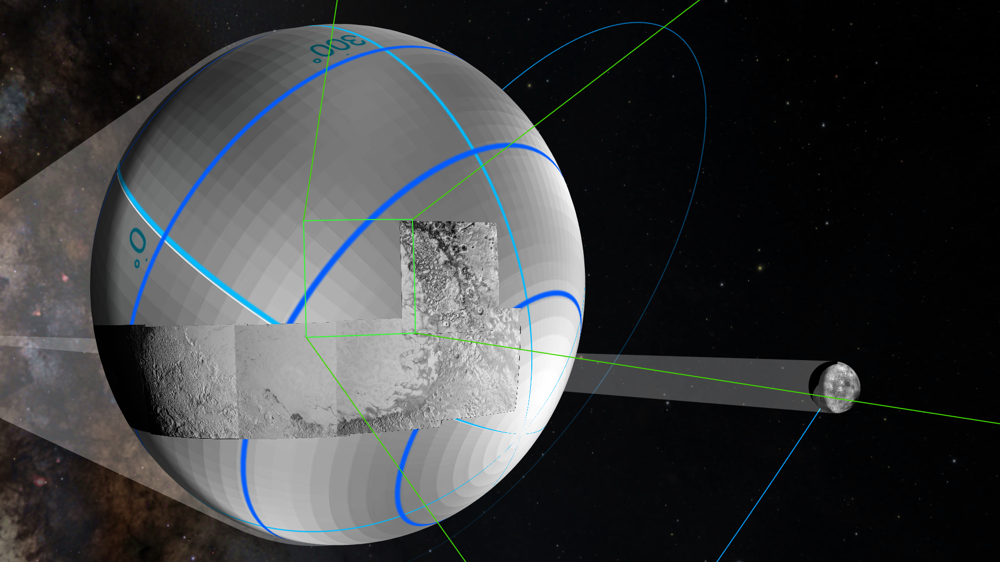

Title: OpenSpace -- Changing the narrative of public dissemination from **what** to **how**

Authors: Alexander Bock, Emil Axelsson, Carter Emmart, Masha Kuznetsova, Anders Ynnerman

# Introduction

Since the dawn of time humans have looked into the night sky in an attempt to understand the mysteries of the world.  The movements of the Moon, the stars and the planets have guided the rise of civilizations by producing calendars and aiding in navigation, while the shape of patterns in the night sky has inspired tales told all around the world.  The history of humankind has been shaped by our Moon, the five planets and the roughly one thousand stars that are visible to the naked eye.  In more recent times ground based large scale telescopes and satellite based instruments have enabled us to see that what we humans can see is no more than a tiny slice of an observable universe consisting of billions of galaxies, innumerable stars and, most recently, exoplanets which have only been identified in the last twenty-five years.

Understanding the process of scientific discoveries and their results is key to understanding our cosmic origins, potential dangers, and our long-term future.  While small telescopes are readily available, and allow amateur astronomers a somewhat deeper view into the cosmos, only a small and enthusiastic group of people are sufficiently dedicated to deal with the complexity of the calibration, assembly, and usage of home telescopes.  The rest of humanity has to rely on professionally operated telescopes to collect the data and produce the stunning pictures of the night's sky that are the result of very long exposures which cannot be seen with the human eye.  Unfortunately, the context within which these images are taken is often lost, even when it comes to the most simple of tasks such as locating the photographed area in the sky.  For many years, planetariums have tried to provide this context to the public by reproducing the night sky on a dome surface and support explanations and try to tell compelling stories.  These explanations are often provided by an expert and grant easy access to the knowledge about the cosmos and all its wonders.

In this paper we describe a software platform named *OpenSpace* which paves the path for the next generation of science communication and data exploration in the astrophysical and space exploration domain.  It capitalizes on the digitalization of planetariums undergone during the last decade [1], state-of-the art immersive 3D computer graphics [2], the development of novel visualization methods, and access to unique data sources.  It is, furthermore, an open source platform designed to support community efforts, both in the provision of new software features and new content.

Even though OpenSpace targets high-end installations, such as planetariums and dome theaters, it supports a wide range of platforms and thus has a much wider reach than proprietary planetarium software and can even be used on home computers for free.  While home use currently removes the immersive experience it opens up the public access enormously.  Furthermore, the ongoing proliferation of head mounted displays, such as the Oculus Rift or the HTC Vive, will make it possible for a home user to have a similarly immersive experience using their own home computer as can be had in the planetarium setting.  With the prices of these devices continually falling, many more people will be able to afford and utilize such devices.

At the core of the narratives that OpenSpace enables lies an evolutionary step in science communication that scientists and educators promoting and supporting.  This is the gradual transition in explanations from **what** has been discovered by telescopes and measurements over to **how** it is being discovered.  The idea behind this is to not only show scientific results, but to also explain the planning stages and the intricate processes of the data acquisition itself.  By including the general public in the process of scientific discovery it allows the audience to understand the underlying complexity and gain a deeper appreciation for the data collected.  This will ultimately result in a better educated populous who are more willing to spend the effort and resources needed to widen our collective scientific horizons.

OpenSpace contributes to the evolution of science communication in several ways.  Providing that information in a context which enables the public to understand both aspects of the nature of scientific information is extremely important, and the narratives used can be vital in informing the public and enabling them to understand the importance of such work and its influence upon their lives and their future.  In the world of education the idea of 'doing beats telling' is a very common refrain and the purpose of the tools described in this paper is to provide for both.  The platform enables joint scientific exploration by expert groups, dissemination by the knowledgeable audiences of all sizes, as well as independent learning by students looking for insight.  The interactive nature of the exploration provided in the OpenSpace environment permits far greater learning benefits than the use of pre-rendered informational content which, while providing solid and reliable information, does not permit the audience either the pleasure or the impact of personal exploration. Finally OpenSpace constitutes an example of how visualization offers an exploratory approach to scientific knowledge dissemination and documents developer and user experiences to the benefit of similar endeavours in other scientific domains. 

The paper includes a presentation of the OpenSpace concepts for data exploration and dissemination, and demonstrate its utility through four specific applications: the *New Horizons* spacecraft fly-by event at Pluto in July 2015, the *Rosetta* spacecraft entered the orbit of the comet 67P/Churyumov-Gerasimenko in August 2014, performing measurements during its approach to the Sun, the study of the solar system conditions collectively known as *Space weather*, and a system for interactive display of high resolution level-of-detail planetary images, exemplified in the rendering of Earth and Mars.  All these events had different parameters and objectives and highlight a variety of challenges, whose solutions are applicable to similar events.

# The OpenSpace software platform

 *OpenSpace*  enables the dissemination of scientific data to experts and the general public alike.  The system is not limited to any specific scientific domain but has been designed to support a large number of contextualized objects, such as geometric models, volumetric data, data-derived geometry, or abstract data derived from a wide variety of sources including astrophysical data repositories or simulation data.  An important aspect of these datasets is dynamic and time-varying processes which have to be accurately represented.  The software is being developed in close collaboration with the user community, astronomers, space physics researchers, and the planetarium community.  By providing an open source, rich, modular framework we are seeking to enable developers to easily extend and integrate new visualization approaches and build an ecosystem of modules that is accessible and can be used by anyone.  Furthermore, the open source license enables the software to support a wide variety of platforms, such as large scale display environments or immersive theaters.  This, in turn, enables the collaborative and distributed visualization approaches that can benefit the wider public.

Other applications have previously provided a similar service, such as Uniview, Digital Sky, Digistar, Eyes on the Solar System, and others.  Many of these systems are commercial products and may require specialized hardware or software licences which limits their potential outreach to venues which have sufficient revenue to afford them.  In addition, the closed-source nature of these products limits the variety of data that can be displayed.  Through the use of an open-source approach we have reduced the necessary investment for the community to develop and include new rendering techniques, incorporate new data types and sources and so produce an environment which can benefit a whole new generation of information providers and students.  One important historical application that has attempted to address this problem in the domain of space science is Celestia, whose open-source development effectively stopped in 2010.  With *OpenSpace* we are building on the success of open-source software to provide a content-rich, community-curated environment for the general public as well as planetariums that is based on state-of-the-art computer graphics and visualization tools.  Having a central instance that combines the efforts of small-to-medium venues and private citizens makes it possible to combine the benefits of a wide user base with the necessary expert knowledge for data integration.  In the following sections, we describe the building blocks that have been used to generate the current platform.

## Dynamic Scene Graph
Integrating many large-scale astronomical data sets into a common reference frame can be taxing as the floating point representation of numbers in computers does not have infinite precision [3].  This restricts the relative scales of objects which can be represented in a single scene.  The most widely used floating point number formats in computing are defined in the IEEE 754 standard as single and double precision with 32 bit and 64 bits, respectively.  Combining the floating decimal point and the finite storage means that the precision of the numerical representation of numbers decreases with increasing magnitudes.  This does not become an issue as long as objects of similar magnitude are displayed.  However, if objects on vastly different scales are involved, an accurate representation is no longer possible.  As an example, the minimum value that can be added to a single precision floating point value, $v$, is $\approx 6*10^8 \cdot v$.  Every number smaller than that will be reduced to zero change. Without any special consideration, this inhibits the use of a single coordinate system for objects even in our solar system.  In the case of Pluto and Sun being the origin of the coordinate system, the distance of $\approx ~5*10^9$ km results in a distance of about 300 km between representable floating point values.

One possible solution to this issue is the concept of a ScaleGraph [4] which is a modified scene graph that contains different scales as intermediate nodes.  Each scale describes distances to child nodes and objects in their canonical scaling. This graph structure then enables translation and scaling of each visible object in the scene to be represented at the correct relative size without loss of precision.  However, due to a necessary reprojection, issues related to stereoscopic rendering and scale transitions are introduced.  Another solution is the use of additional bytes to represent a greater range of numbers.  Fu and Hansen developed Power Scaled Coordinates which use a fourth floating point value to represent an exponential component [5].

In *OpenSpace* we instead employ a Dynamic Scene Graph which is similar to the ScaleGraph but does not utilize native scales and does not explicitly reproject objects to the current scale [6].  Instead, all objects in the scene are rendered relative to the camera at their correct distances with the closest object to the camera always serving as the global coordinate system origin.  This makes use of the fact that for far away objects to be visible, they have to be sufficiently large, and can be rendered with a lower level of detail.

## SPICE
In order to render astronomical objects in their correct positions, potentially complex trajectories have to be computed.  In the easiest case, that of undisturbed orbits, the only information necessary is the six Keplerian elements from which the location of a body relative to a target reference frame can be retrieved.  However, this simple representation does not capture any complex orbital mechanics such as the influence of additional bodies or effects from general relativity such as seen in, for example, the precession of Mercury.  Therefore, a more sophisticated method for determining complex orbits has to be employed.

One widely used library, known as *SPICE*, is provided by NASA and supports access to location and attitude of spacecraft, planets, and other objects of sufficient quality for mission planning. This is provided through the use of data objects known as *SPICE kernels*. One type of SPICE kernel provides location information for a specific time period.  While these can be provided analytically, in most cases a higher order approximation or explicit sampling strategy is used for spacecraft with complex trajectories.  Using the SPICE library provides instant access to all of this information and the capability to query locations in a variety of coordinate systems, enabling use of an optimal coordinate system for each object.  Furthermore, it provides information about instruments on-board spacecraft such as the viewing angle, the shape of the field-of-view, or conversions regarding the on-board mission clock.

SPICE kernels are heavily used by spacecraft operators in the planning phase of missions which has the additional benefit of making these kernels readily available for a large number of active missions. It also guarantees the accuracy of the kernels since, while the scientific accuracy required for displaying the data for an audience is high, the spacecraft planning and development phases necessitate an even higher level of accuracy.

## Digital Universe

Figure 1. An accurate and visually well designed representation of the night's sky provides necessary spatial context to any solar system-based visualization.  This image shows 100000 stars from the Hipparcos and Gliese star catalogs.

Measurements of stars and galaxies have been performed over the course of many years, leading to  inconsistencies in the provided data formats and coverages.  One successful effort to curate all available datasets is the *Digital Universe*, hosted by the American Museum of Natural History.  It collates information such as position, colour, images, and spectral measurements of many visible stars in the Milky Way, as well as data about galaxies, quasars, and other celestial objects.  By incorporating this extensive database it is possible to render a visually appealing and accurate 3D representation of the night sky (see Figure 1) and so provide the necessary context to activities within the solar system, as well as allowing the possibility to integrate representations of events outside of the solar system and provide a three dimensional view on the stars closest to the Sun.

Stars are rendered as camera-aligned billboards where the billboard is resized according to the distance to the camera as well as the absolute brightness of the star; the closer and brighter a star is, the bigger the billboard.  This represents an artistic choice.  In a more physically correct rendering each star, regardless of distance and brightness, would have the same size which would be very close to a perfect point light source (Sirius, the brightest star as seen from Earth, has an angular extent of $8.5 \cdot 10^{-7}$ degrees). Our eyes and telescopes, however, apply a point spread function that extends this point into an image.  The result depends on the apparent magnitude of the star which, in turn, depends on the distance to the camera and the absolute brightness of the star.  We simulate this point spread function of an idealized telescope on the billboard by applying a Gaussian falloff.  This results in a realistic and appealing visual representation.  By interactively computing the apparent magnitude we also account for the changing location of the camera when moving outside of the solar system.  This produces a rendering of the stars as a telescope at the position of the virtual camera would perceive them.  In addition, by replacing the texture used for the point spread function, it is possible to simulate the visual appearance as seen using a variety of telescopes.

For all galaxies except the Milky Way, a similar billboard technique can be applied. Instead of aligning the billboard to the camera, however, it has to be aligned to the location of the Sun in order to provide the ability to fly close to a distant galaxy and retain the view as seen from Earth.  Instead of using a Gaussian point spread function, the image as captured by various telescopes is used while the billboard is resized to reflect their accurate projected size.  These images can be reconstructed from optical light or from any other detection method. 

Figure 2. A volumetric rendering of the Milky Way using a statistical distribution of stars and gas which provides a context for a representation of the local neighborhood and our Sun's position inside the Milky Way.

While inside our solar system the Milky Way cannot, of course, be projected as a billboard since it surrounds the camera in every direction.  Hence we make use of a textured sphere that has an omnidirectional texture of the Milky Way mapped to its interior surface as an environment map.  For the texture we use a modified version of an all-sky survey by Mellinger [7] to which a post-processing has been applied to remove all visible stars.  While this representation appears correct while the camera is inside our solar system, the sphere has to be replaced by a simulated, volumetric representation of the Milky Way when the camera is outside the local area of the solar system.  This volumetric data is generated from statistical models of matter distribution in our galaxy which simulate the presence of various kinds of dust, the location of stars and much more (see Figure 2).

## Planetary Rendering
An important aspect in viewing scientific discoveries is providing an adequate context such as representations of planetary surfaces which are an important aspect for the visual fidelity of the system.  For many planets in the solar system, such as Earth, Mercury, or Mars, images of such high detail have been acquired that simple texturing is unfeasible and a hierarchical level-of-detail approach which takes into account both the distance of the camera to the planet as well as the planet's visual footprint is required.  The same aspect applies to detailed terrain models, such as height maps, which are subsequently used to position other objects on the surface of a planet.

Figure 3. A large number of datasets are available for Earth.  This case uses the ESRI World Imagery dataset to show the mountains of the Himalayas with the Moon in the sky.  High-resolution images, digital terrain models and annotations are available for large areas our planet.

Figure 4. High-resolution datasets are also available for other planets in our solar system, such as Mars.  The images and digital terrain models are constructed from the Mars Reconnaissance Orbiter's Context and HiRISE cameras, whose primary goal is to map future landing sites.

To this end, OpenSpace makes use of a widely used set of standards for the delivery of planetary images called the *Web Map Service* [8].  These standards provide a level-of-detail technique to request image tiles for a planet's surface and support very high resolution data.  By treating local height information as a greyscale image, it furthermore becomes possible to produce 2.5D terrain rendering through the same methods (see Figure 3).  One use case for this application is data from the fleet of Earth-orbiting spacecraft gathering a variety of measurements, for example measurements of the ozone layer, pollutants, or temperatures.  Another use case is a high fidelity rendering of other planetary surfaces.  For Mars there exists a large database of surface images retrieved from the Mars Reconnaissance Orbiter that can be used to create realistic-seeming surface renderings of planets that no human has observed in real-life (see Figure 4) [9].

Supporting a wide variety of standards for image loading is an important aspect for specialization, since many public venues have access to high-resolution aerial photography of their immediate surroundings and would like to integrate this in order to provide a higher fidelity experience for visitors to a specific location.  Creating a database of these higher terrain resolutions is a potential citizen scientist project enabled by the OpenSpace platform.

## Image Projection
Distributed throughout the solar system, the human fleet of spacecraft have a wide variety of instruments available such as radiometers, dust counters and magnetometers, to gather information.  The instruments that are most intuitive for the general public, and so draw the most attention, are the image-generating cameras.  Ranging from the cameras on board Luna 3, taking grainy pictures of the far side of the moon in 1960, to the modern high-resolution cameras on board the New Horizons spacecraft, taking pictures of Pluto in 2015, the images produced from spacecraft have always inspired the public and are hugely successful in generating public interest and understanding.

Figure 5. This image shows a typical example of the image acquisition by New Horizons' LORRI camera of the surface of Pluto and shows the improved quality of the images acquired by this probe over previous Hubble images.  The ability to show the raw, uncorrected images provide the public with an insight into the complexity of the mosaic image acquisition process.

Figure 6. By projecting images onto an additional image plane it becomes possible to display comet outgassing as it occurs, in this case on the comet 67P/Churyumov-Gerasimenko as it approached the Sun, together with the resulting spacecraft trajectory considerations.

Our goal when producing images of space missions is not to present just the the final images, but to show the context of their acquisition and their spatial relationships with respect to the target body and other images.  In order to achieve this, we make use of an image projection method presented by Everitt et al [10] to project the images onto the target body.  Using information about the camera's direction and field of view, together with the acquisition time, it is possible to treat the camera as a virtual projector that casts the image onto the target body (see Figure 5).  This method resolves projection artifacts and is easily generalized to include multiple images or non-standard image geometries.  Furthermore, by including an additional virtual  plane upon which to project the image, it is possible to handle images in which the target object does not fill the entire frame or where the subject of interest is not a physical body (see Figure 6).

While this method is easily applicable to spherical bodies, as they present no self-shadowing, it becomes more difficult on complex geometries which include concavities.  The standard image projection algorithm does not include any occlusion checking, which can lead to undesirable visual results.  One possible solution to this problem is to use a shadow map algorithm that identifies the target object's first projection point for a given camera frustum.  Only the points that are not in the shadow from the camera are used for the projection.  With this method it is possible to project images onto irregular bodies such as the comet 67P/Churyumov–Gerasimenko (see Figure 6).

### New Horizons

Figure 7. New Horizons' view of Pluto and its moons a few hours before closest encounter. The active LORRI camera's frustum is shown extending from the spacecraft and is used to contextualize the image acquisition of Pluto and its moons.  In addition, the artificially displayed 'shadow' of Pluto provides the public with a visual cue as to the direction towards the inner solar system.

NASA's New Horizons mission flew by the Pluto system on July 14th, 2015 and made measurements with its seven instruments.  Of special interest are the LORRI and RALPH instruments which provided images of Pluto, Charon, and other moons' surfaces, as well as the REX instrument which made measurements of Pluto's atmosphere (see Figure 8).  In OpenSpace the measurement times for all instruments are presented to the user but not all instruments have a direct visual mapping. This mission was shown to about 2000 people during a public, global event in which 13 different locations participated.  During the two hour live show, which coincided with New Horizons closest approach to Pluto, experts on the mission team explained details of the desired outcome using *OpenSpace* to contextualize the operations of the instruments concurrent with the fly-by.  In addition to the live audience in the participating locations, a video stream of the event was available on the Internet and was also later provided as a streaming video, called "Breakfast at Pluto".

### Rosetta

Figure 8. Projecting multiple images onto an accurate model of the concave comet 67P/Chryumov-Gerasimenko enables the explanation of spacecraft operations, taking, for example, the varying phase angles into account.

ESA's Rosetta mission orbited the comet 67P/Churyumov-Gerasimenko between August 2014 and September 2016 at various altitudes while providing measurements about the comet's activity, its mass, and the amount of outgassing.  Among the instruments are the fairly low resolution NAVCAM, which is primarily used for navigational purposes, whose images were released to the public much earlier than from other instruments.  The OSIRIS camera is a high-resolution 2048x2048 pixel optical camera with a narrow angle and wide angle lens.  Images from both instruments can be used with previously described image projection (see Figure 9).  An interesting aspect of this mission is the complexity of the spacecraft's trajectory around the comet and thus the ability to explain complicated aspects of orbital mechanics using Rosetta as an example.  These range from the ability to measure the weight of the comet based on the deflection of the orbit, the avoidance of outgassing at the comet's aphelion, or the release of the Philae lander.

### Osiris Rex
Osiris Rex is a NASA mission that will orbit the asteroid Bennu and perform a sample return mission.  It launched in September 2016 and will end with a landing back on Earth in 2023.  During its stay at the asteroid, Osiris Rex will take detailed images of the entire surface of the asteroid.  This information will then used to select a sample site from which the asteroid samples will be collected.  In an event at the American Museum of Natural History, one of the mission scientists explained the entire plan of the mission, from launch to touch down, to a public audience.  This mission is especially interesting since the spacecraft changes the position of the solar panels to be able to collect samples from the asteroid without touching its surface or contaminating the acquired samples.

## Space Weather
Space Weather research is concerned with plasma conditions in the solar system ultimately caused by the activity of the Sun.  These conditions have a significant impact on both satellites and on life on Earth, making predictions of space weather very important.  Combining this with the complexity of the topic warrants the use of visualization techniques to bridge the gap between expert knowledge and public understanding.  We have, therefore, integrated the scientists' Integrated Space Weather Analysis toolkit, developed at the Community Coordinated Modeling Center at NASA Goddard, into *OpenSpace* such that the results can be directly disseminated to the public using the same expert analysis tools.  This also ties directly into NASA's Living with a Star program, whose mission is to improve the understanding of the Sun and how it affects the entire solar system.  One part of this work, dealing with improving the forecasting capabilities by producing comparisons between simulations and in situ measurements, has been presented previously [11].

# Dome Casting

Figure 9. Utilizing the dome casting feature enables a collaborative session, including multiple experts, that explains complex topics to a large public audience.  By streaming these sessions online, their potential outreach is improved by orders of magnitude.  The New Horizons presentation, for example, has been seen by over 50000 people worldwide.

One important feature of *OpenSpace*, enabling the mass public dissemination of scientific topics, is the concept of **Domecasting**.  Using a set of features that allow multiple instances of *OpenSpace* to be connected and to replicate renderings on a multitude of distributed systems, it becomes possible to share explanations across the globe (see Figure 9).  Each instance of *OpenSpace* runs independently but rendering settings are synchronized via internet connections.  These rendering settings include information about the virtual camera, the simulation time, changes to the simulation time, as well as other information influencing every aspect of the rendering process, such as textures, adjustable transparencies, or enabling and disabling objects. Small delays in his communication are acceptable as only information about changes is transmitted.  For a truly collaborative experience, with presenters that are located at the separate sites, it is also desirable to pass control between different application instances, thus enabling common decision making or information dissemination to the public.  Each *OpenSpace* instance runs independently and, instead of receiving a pre-rendered image for display, renders the image as appropriate for the local display geometry.  For example, some clients might run a multi-pipeline planetarium setup while others run a single computer producing images for a flat screen.  By abstracting this away from any remote operations the system becomes more stable and is agnostic to rendering changes.  In order to support venues that do not have the computational resources to perform rendering locally, the software has the capability to stream a 360 degree rendering, which can then be locally reprojected as required.

# Conclusions
In this paper, we present an open-source framework called *OpenSpace* that supports the public dissemination of **how** scientific discoveries are made rather than purely focussing on **what** has been discovered.  This capability has been demonstrated in four different use cases, showing the usability of such an approach when performing public presentations.  By making the software freely available it is possible to reach a much broader audience than previous solutions which are directed towards larger planetarium venues and so a smaller audience.  This also creates opportunities for citizen science projects that curate the vast amount of information that we have gathered about the universe and thus engage a wider fraction of the population in the scientific endeavour.

[1] Carolyn Sumners and Patricia Reiff. "Creating Full-Dome Experiences in the New Digital Planetarium." In NASA Office of Space Science Education and Public Outreach Conference, vol. 319, p. 155. 2004.

[2] Miguel A. Aragon-Calvo, and Mark SubbaRao. "A Flight through the Universe". Computing in Science & Engineering 17, no. 6 (2015).

[3] David Goldberg. "What every computer scientist should know about floating-point arithmetic". ACM Computing Surveys 23, no. 1 (1991).

[4] Staffan Klashed, Per Hemingsson, Carter Emmart, Matthew Cooper, and Anders Ynnerman. "Uniview-Visualizing the Universe". Eurographics 2010-Areas Papers (2010).

[5] Phillip Fu, Andrew Hansen. "A transparently scalable visualization architecture for exploring the universe". IEEE Transactions on Visualization and Computer Graphics (2011).

[6] Emil Axelsson, Jonathas Campi Costa, Claudio Silva, Carter Emmart, Alexander Bock, and Anders Ynnerman, "Enabling Scaling, Positioning, and Navigation in the Universe". EuroVis (2017).

[7] Axel Mellinger. "A color all-sky panorama image of the Milky Way". Publications of the Astronomical Society of the Pacific 121, no. 885 (2009): 1180.

[8] Open Geospatial Consortium. "OpenGIS Web Map Service version 1.3.0". (2006).

[9] Karl Bladin, Emil Axelsson, Erik Broberg, Carter Emmart, Patric Ljung, Alexander Bock, and Anders Ynnerman, "Globe Browsing: Contextualized Spatio-Temporal Planetary Surface Visualization". IEEE Transactions on Visualization and Computer Graphics (2017).

[10] Cass Everitt, Ashu Rege, and Cem Cebenoyan. "Hardware shadow mapping". White paper, nVIDIA 2 (2001).

[11] Alexander Bock, Asher Pembroke, M. Leila Mays, Lutz Rastaetter, Timo Ropinski, and Anders Ynnerman. "Visual verification of space weather ensemble simulations". In 2015 IEEE Scientific Visualization Conference (2015).

